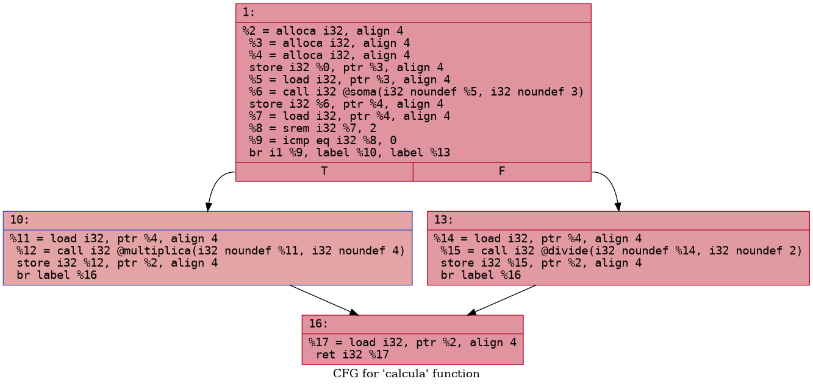

# 2. Código C e Geração de IR

##  Como estão representadas as funções soma, multiplica e calcula em IR?

### Soma:
```
; Function Attrs: noinline nounwind optnone uwtable
define dso_local i32 @soma(i32 noundef %0, i32 noundef %1) #0 {
  %3 = alloca i32, align 4
  %4 = alloca i32, align 4
  store i32 %0, ptr %3, align 4
  store i32 %1, ptr %4, align 4
  %5 = load i32, ptr %3, align 4
  %6 = load i32, ptr %4, align 4
  %7 = add nsw i32 %5, %6
  ret i32 %7
}
```

### Multiplica:
```
; Function Attrs: noinline nounwind optnone uwtable
define dso_local i32 @multiplica(i32 noundef %0, i32 noundef %1) #0 {
  %3 = alloca i32, align 4
  %4 = alloca i32, align 4
  store i32 %0, ptr %3, align 4
  store i32 %1, ptr %4, align 4
  %5 = load i32, ptr %3, align 4
  %6 = load i32, ptr %4, align 4
  %7 = mul nsw i32 %5, %6
  ret i32 %7
}
```

### Calcula:
```
; Function Attrs: noinline nounwind optnone uwtable
define dso_local i32 @calcula(i32 noundef %0) #0 {
  %2 = alloca i32, align 4
  %3 = alloca i32, align 4
  store i32 %0, ptr %3, align 4
  %4 = load i32, ptr %3, align 4
  %5 = icmp sgt i32 %4, 10
  br i1 %5, label %6, label %9

6:                                                ; preds = %1
  %7 = load i32, ptr %3, align 4
  %8 = call i32 @multiplica(i32 noundef %7, i32 noundef 2)
  store i32 %8, ptr %2, align 4
  br label %12

9:                                                ; preds = %1
  %10 = load i32, ptr %3, align 4
  %11 = call i32 @soma(i32 noundef %10, i32 noundef 5)
  store i32 %11, ptr %2, align 4
  br label %12

12:                                               ; preds = %9, %6
  %13 = load i32, ptr %2, align 4
  ret i32 %13
}
```

## O que aparece no IR que representa a condição if (valor > 10)?
  ```
  %4 = load i32, ptr %3, align 4
  %5 = icmp sgt i32 %4, 10
  br i1 %5, label %6, label %9
  ```

## Como são representadas as chamadas às funções auxiliares em IR?
### Chamada à função multiplica:
  ```
  %7 = load i32, ptr %3, align 4
  %8 = call i32 @multiplica(i32 noundef %7, i32 noundef 2)
  store i32 %8, ptr %2, align 4
  ```

### Chamada à função soma:
  ```
  %10 = load i32, ptr %3, align 4
  %11 = call i32 @soma(i32 noundef %10, i32 noundef 5)
  store i32 %11, ptr %2, align 4
  ```

### Chamada à função calcula no main:
  ```
  %3 = call i32 @calcula(i32 noundef 7)
  store i32 %3, ptr %2, align 4
  ```

# 3. Modificação do Código

## Como o if (temp % 2 == 0) aparece no IR?
  ```
  %7 = load i32, ptr %4, align 4
  %8 = srem i32 %7, 2
  %9 = icmp eq i32 %8, 0
  br i1 %9, label %10, label %13
  ```

## Como o operador % (módulo) é representado no LLVM IR?
  ```
  %7 = load i32, ptr %4, align 4
  %8 = srem i32 %7, 2
  %9 = icmp eq i32 %8, 0
  ```

## Quais são os blocos básicos criados pela nova lógica condicional?

### 1. Inicialização, chamada para soma e teste da condição
  ```
  %2 = alloca i32, align 4
  %3 = alloca i32, align 4
  %4 = alloca i32, align 4
  store i32 %0, ptr %3, align 4
  %5 = load i32, ptr %3, align 4
  %6 = call i32 @soma(i32 noundef %5, i32 noundef 3)
  store i32 %6, ptr %4, align 4
  %7 = load i32, ptr %4, align 4
  %8 = srem i32 %7, 2
  %9 = icmp eq i32 %8, 0
  br i1 %9, label %10, label %13
  ```

### 2. True: Número par
  ```
  10:                                               ; preds = %1
  %11 = load i32, ptr %4, align 4
  %12 = call i32 @multiplica(i32 noundef %11, i32 noundef 4)
  store i32 %12, ptr %2, align 4
  br label %16
  ```

### 3. False: Número ímpar
  ```
  13:                                               ; preds = %1
  %14 = load i32, ptr %4, align 4
  %15 = call i32 @divide(i32 noundef %14, i32 noundef 2)
  store i32 %15, ptr %2, align 4
  br label %16
  ```

### 4. Bloco de convergência, retorna o resultado final
  ```
  16:                                               ; preds = %13, %10
  %17 = load i32, ptr %2, align 4
  ret i32 %17
  ```

# 4. Otimização com opt

## Que mudanças ocorreram na função main após a otimização?
  - O valor passado para a função calcula mudou de 5 (no código não otimizado) para 7 (no código otimizado).
  - Não há mais variáveis ou instruções desnecessárias, o código está mais enxuto, mantendo apenas o essencial: alocação das variáveis, chamada da função calcula, armazenamento do resultado e chamada do printf.
  - O atributo local_unnamed_addr foi adicionado à função, indicando uma otimização de endereço para variáveis locais.

## Alguma função foi inlined (inserida diretamente)? Como identificar?
  Quando uma função é inlined, o corpo dela aparece diretamente no local da chamada, e não há mais chamadas (call) para essa função. No arquivo da atividade nenhuma função foi inlined (inserida diretamente) após a otimização. As funções soma, multiplica, divide e calcula continuam existindo como funções separadas, e ainda há instruções call para elas. Além disso, todas estão marcadas com o atributo noinline, que impede explicitamente a aplicação de inlining pelo otimizador.

## Alguma variável intermediária foi eliminada? Por quê?
  Sim, algumas variáveis intermediárias foram eliminadas após a otimização. No IR otimizado, existem menos instruções alloca, store e load desnecessárias, e as operações são feitas de forma mais direta, sem criar variáveis temporárias para cada etapa intermediária.
  
  O otimizador do LLVM remove variáveis intermediárias que não são necessárias para o resultado final, simplificando o código. O código otimizado mantém apenas as alocações e operações essenciais para o cálculo e saída, eliminando instruções redundantes, o que reduz o uso de memória e melhora a eficiência do código gerado.

# 5. Visualizando o Grafo de Fluxo de Controle (CFG)

## Quantos blocos básicos você consegue identificar na função calcula?
  Quatro blocos básicos
  

## Quais são os caminhos possíveis a partir da condição if (temp % 2 == 0)?
  Se for True, desvia para o label 10 e False desvia para o label 13. Como mostra a figura do item anterior.

## O fluxo de controle inclui blocos de erro ou casos não triviais (e.g., retorno precoce)?
  O código possui blocos de verificação de divisão por zero e, no caso das modificações do código original pedidas, incluí verificação para valores negativos. Quando essas condições são detectadas, o fluxo desvia para blocos que armazenam -1 como valor de retorno, indicando erro.

## Há blocos com apenas instruções de salto? O que você imagina que isso indica?
  Sim, há blocos com apenas instruções de salto como blocos que só possuem a instrução br label. São blocos que apenas realizam o fluxo de controle o que facilita o retorno de valores ou execução de instruções após ramos de uma decisão.
